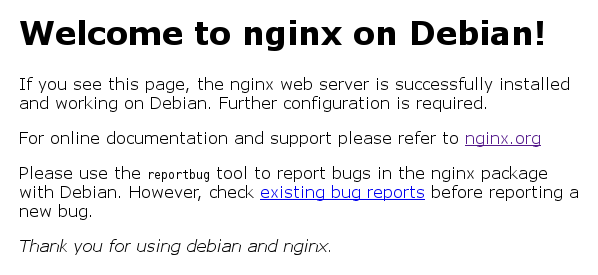
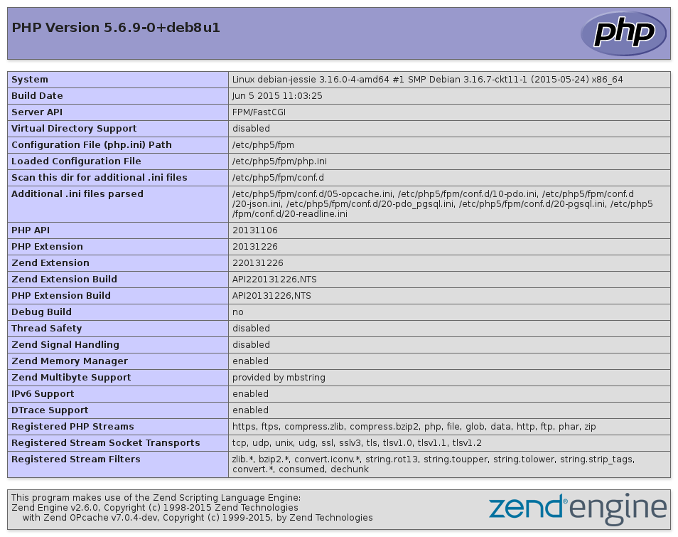

# Le serveur web

Un serveur web permet de délivrer des pages que vous pouvez consulter via
votre navigateur. C'est certainement la part la plus visible d'internet.

Il en existe plusieurs, le plus connu est [apache](http://httpd.apache.org/)
mais il peux demander beaucoup de ressources pour être utilisé sachant que nous
n'utiliserons pas la moitié de ses fonctionnalités. J'ai opté pour
[nginx](http://nginx.org/) mais si vous êtes curieux, il en existe d'autres :

* [lighttpd](http://www.lighttpd.net/) ;
* [Cherokee](http://www.cherokee-project.com/).

Même si un serveur web est suffisant pour publier quelques pages en HTML, si
vous souhaitez par la suite installer des logiciels tel qu'un blog ou un forum
vous aurez également besoin d'une [base de données](http://fr.wikipedia.org/wiki/Base_de_données)
et d'un langage de programmation tel que [PHP](http://fr.wikipedia.org/wiki/PHP).

> **Note** J’ai choisi PHP car c’est celui que je maitrise le mieux et sa
> popularité vous assure de trouver un grand nombre de logiciels.

Les trois étant très souvent installés en même temps, nous allons en faire de
même afin que vous disposiez, la fin de ce chapitre, d'un serveur web digne de
ce nom.

## Nginx {#nginx}

Commençons par installer notre serveur HTTP :

```
# apt-get install nginx
```

Au niveau de la configuration de notre serveur, vous pouvez commencer par ouvrir
le fichier `/etc/nginx/nginx.conf` qui contient la configuration globale du
serveur. Dans le cadre d'une utilisation normale, il n'est pas utile de modifier
ce fichier.

Les parties intéressante de la configuration de nginx se trouve dans les
répertoires `/etc/nginx/conf.d` pour les modules qui impacts tous les sites
(typiquement [TLS](tls.md)) et `/etc/nginx/sites-available/` pour les
configuration liés à chaque site. Nous y reviendrons une fois tous les autres
composants installés.



## Postgresql {#postgresql}

Concernant la base de données, je vous propose un peu d’originalité. Normalement
j’aurais du vous présenter MySQL, sauf que son installation est extrêmement
simple mais suretout je préfère vous faire découvrir une base de données Libre
et communautaire qui vous fera retrouver foi dans le SQL[^1].

L'installation se passe de commentaire :

```
# apt-get install postgresql postgresql-client
```

Si l’installation n’a rien de compliquée, sa configuration a pour réputation de
l’être. Dans un premier temps je me suis contenté de la configuration par défaut
sans que cela me pose de problème (on reste sur des applications de tailles
modestes), mais après avoir découvert l’outils
[pgtune](http://pgtune.leopard.in.ua/) il n’y a pas de raison de se priver de
quelques optimisations :


Avec PostgreSQL c’est l’utilisateur `postgres` qui possède tous les droits. Afin
de nous simplifier la vie, nous pouvons créer un utilisateur pour PostgreSQL
avec le même nom que notre utilisateur système :

```
$ sudo -u postgres createuser --interactive
Enter name of role to add: sanpi
Shall the new role be a superuser? (y/n) y
```

Nous pouvons maintenant créer notre première base de données :

```
$ createdb sanpi
```

Ainsi nous pouvons nous connecter directement :

```
$ psql

psql (9.4.3)
Type "help" for help.

sanpi=# \?
…
```

## PHP {#php}

Le dernier élément, le langage de script PHP. Il s'agit de la phase de
l'installation la plus compliquée (ça reste relatif…) puisqu'il va falloir
faire le lien entre le serveur HTTP, PostreSQL et PHP.

Commençons par installer l'interpréteur, mais nous avons également besoin du
module pour PostreSQL :

```
# apt-get install php5-fpm php5-pgsql
```

Pour la configuration, vous pouver lire le fichier `/etc/php5/fpm/php.ini` mais
il ne faut pas le modifier directement[^2]. Créez simplement un fichier
`/etc/php5/mods-available/custom.ini` qui contient vos modifications :

```ini
date.timezone = Europe/Paris
opcache.enable = 1
opcache.save_comments = 1
opcache.load_comments = 1
```

Et activer cette configuration pour FPM :

```
# ln -s /etc/php5/mods-available/custom.ini /etc/php5/fpm/conf.d/99-custom.ini
```

[FPM](http://php-fpm.org/) est l’une des manières d’intéragir avec PHP, vous
avez peut être déjà entendu parler de CGI ? Cette SAPI se veux simple et
robuste. En tant d’utilisateur, je retiens surtoût la possibilité de faire
tourner PHP avec un utilisateur arbitraire ce qui vous nous éviter beaucoup de
soucis de gestion de droits.

```
# cp /etc/php5/fpm/pool.d/{www,sanpi}.conf
```

Ensuite éditez le fichier pour modifier le nom de la réserve, l’utilisateur et
le nom du fichier d’écoute :

```
# sed -i 's/\[www\]/[sanpi]/g' /etc/php5/fpm/pool.d/sanpi.conf
# sed -i 's/www-data/sanpi/g' /etc/php5/fpm/pool.d/sanpi.conf
# sed -i 's/php5-fpm\.sock/php5-sanpi.sock/g' /etc/php5/fpm/pool.d/sanpi.conf
```

Et redémarrez le service :

```
# systemctl restart php5-fpm.service
```

## Premier site dynamique

À ce stade là, si vous essayez d'afficher une page écrite en PHP, le serveur
vous proposera de télécharger le fichier, ce n’est pas vraiment le comportement
attendu… Tout simplement parce que nous ne l'avons pas configurer pour qu'il
fasse appel à PHP.

On commence par supprimer le site par défaut :

```
# rm /etc/nginx/sites-enabled/default
```

Créons un nouvel hôte virtuel (*virtual host*) :

```
# cat > /etc/nginx/sites-available/php-test <<EOF
server {
    listen 80 default_server;
    listen [::]:80 default_server;

    root /home/sanpi/public_html/test;
    index index.php;

    server_name _;

    location ~ \.php$ {
        include snippets/fastcgi-php.conf;
        fastcgi_pass unix:/var/run/php5-sanpi.sock;
    }
}
EOF
```

Un script PHP minimal pour vérifier que cela fonctionne :

```
$ mkdir -p /home/sanpi/public_html/test
$ cat > /home/sanpi/public_html/test/index.php <<EOF
<?php

phpinfo();
EOF
```

Et enfin rechargeons nginx pour qu’il prenne en compte la nouvelle
configuration :

```
# ln -s /etc/nginx/sites-{available,enabled}/php-test
# systemctl reload nginx.service
```



## Quelques logiciels {#logiciels}

Votre serveur est maintenant fonctionnel, il ne vous reste plus qu'à trouver
des applications pour l'occuper. Comme je le précisais en introduction, le choix
de PHP n'est pas innocent c'est le plus populaire dans ce domaine, vous
trouverez donc des milliers d'applications libres pour créer un blog, un forum,
héberger des images, … Inévitables dans le lot, il existe des applications en
cours de développement, des applications buguées, bref il faut généralement en
tester quelques unes avant de trouver celles qui vous convient.

Voici donc une liste, non exhaustive, d'applications pour fournir les principaux
services :

* [Drupal](http://drupalfr.org/) : au départ je m'en servais pour l'ensemble de
  mes sites, il est très polyvalent ;
* [WordPress](http://www.wordpress-fr.net/) : beaucoup plus simple pour mettre
  en place un simple blog (puisqu'il est justement fait pour…) ;
* [Piwik](http://piwik.org/) : pour suivre l'audiance de vos sites ;
* [Selfoss](http://selfoss.aditu.de/) : un agrégateur de flux RSS,
* [Roundcube](http://roundcube.net/) : pour consulter mes mails en dehors de
  chez moi ;
* [Piwigo](http://fr.piwigo.org/) : pour partager mes photo,
* [Yourls](http://www.yourls.org/) : pour raccourcir les URL ;
* [DokuWiki](http://www.dokuwiki.org/) : pour créer un wiki ;
* [Chevereto](http://chevereto.com/) : pour hébergement rapidement des images et
  ensuite les poster sur un forum, par exemple ;
* [ZeroBin](http://sebsauvage.net/wiki/doku.php?id=php:zerobin) : un
  pastebin-like pour partager rapidement des morceaux de code ;
* [Owncloud](https://owncloud.com/) : synchronisation des fichiers, contacts et
  agenda.

> ***note*** Pour une liste plus complète, vous pouvez parcourir [Awesome
> Selfhosted](https://github.com/Kickball/awesome-selfhosted#awesome-selfhosted).

Vous pouvez vous reporter aux annexes pour un [exemple
d’installation](annexes/owncloud.md).

[^1] Parce que vous n’utilisez plus Windows 3.1, pourquoi continuer à se limiter
au SQL-92 : <http://use-the-index-luke.com/blog/2015-02/modern-sql>

[^2] À la prochaine mise à jour de PHP, vous allez devoir faire la liste des
modifications pour mettre à jour la configuration.
