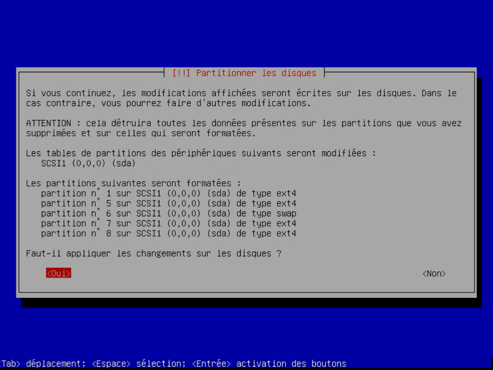
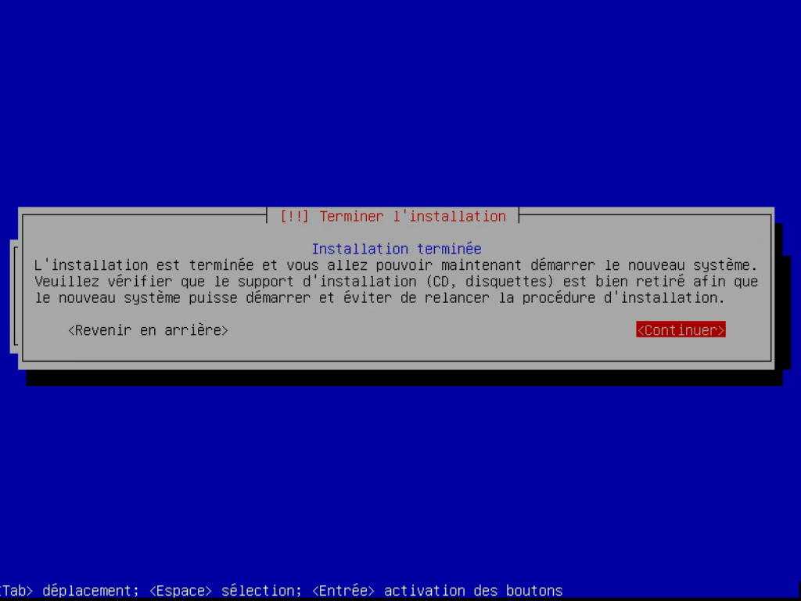
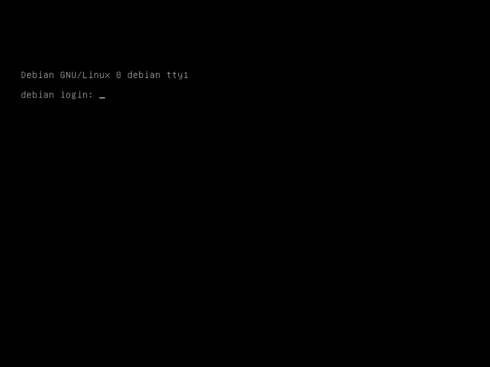

# Installation du système

## Choix de l’OS {#os}

Il est évident que nous allons nous tourner vers un système d'exploitation
Libre, malheureusement il n'existe pas une distribution que je pourrais vous
conseiller c'est à vous de trouver celle qui vous convient le mieux.

Afin de vous aiguiller voici les distributions les plus populaires dans ce
domaines :

  * [Debian](http://www.debian.org/) ;
  * [Unbutu server](http://www.ubuntu.com/server) ;
  * [CEntOS](http://centos.org/).

Je me suis restreint aux distributions GNU/Linux, que je maitrise le mieux, il
est également possible d'utiliser Unix ou Microsoft Windows. Sachant que la
suite de ce livre est basée sur Debian, si vous débutez, vous ne devriez avoir
aucun mal puisque les configurations par défaut son parfaitement adaptée et ce
livre vous guidera pas à pas.

## Préliminaires {#preliminaires}

Avant de nous lancer dans l'installation nous devons préparer le terrain en
téléchargeant notre système et en l'installant sur un support bootable.

### CD {#preliminaires-cd}

C'est la solution la plus simple, encore faut il disposer d'un lecteur de CD,
ce qui n'est pas toujours le cas, en particulier avec le mini-PC.

Commencez par télécharger une image minimale sur le site officiel de
[Debian](http://www.debian.org/CD/netinst/#businesscard-stable) en faisant
attention à l'architecture choisie (généralement amd64). Gravez là sur un
CD, et vous êtes prêt à passer à l'installation.

> **Note** Vérifiez dans le BIOS de votre serveur qu'il démarre en priorité sur
> le CD-ROM.

### Clés USB {#preliminaires-usb}

> **todo** Tester http://www.linuxliveusb.com/fr.html pour Windows

Le principe de cette méthode consiste à transférer l'image d'installation sur
une clés USB préalablement formatée pour être utilisable au démarrage de
l'ordinateur.

> **Warning** Le contenu de la clés USB utilisée sera effacé, vérifiez quelle ne
> contient pas de document important avant de commencer.

Puisque nous sommes encore sur notre ordinateur de bureau, nous pouvons utiliser
des outils graphiques, par exemple [UNetbootin](http://unetbootin.sourceforge.net)
(disponible pour Microsoft Windows et GNU/Linux). Comme le montre la figure
4-1 il vous suffit de sélectionner la distribution souhaitée
et le support de destination.


Ou vous pouvez utiliser la ligne de commande (sous GNU/Linux) en téléchargeant
l'image [boot.img.gz](http://http.us.debian.org/debian/dists/stable/main/installer-i386/current/images/hd-media/boot.img.gz)
et en la copiant sur votre clés :

```
# zcat boot.img.gz > /dev/sdX
```

> **Note** Remplacez `/dev/sdX` par le nom de votre clés USB.

Ensuite, montez cette clés USB (débrancher/rebrancher la clés marche aussi) :

```
# mount /dev/sdX /media
```

Et copiez la même ISO que pour l'installation CD à la racine de la clés.

> **Note** Vérifiez dans le BIOS de votre serveur qu'il démarre en priorité sur
> l'USB et plus précisemment *USB-ZIP*.

Il existe une autre méthode plus détaillée pour créer votre [clés
USB](http://www.debian.org/releases/stable/amd64/ch04s03.html.fr#usb-copy-flexible)
mais en plus de demander quelques connaissances supplémentaires, il faut que
votre serveur puisse démarrer sur *USB-HDD* ou *USB-FDD*.

### Depuis le réseau {#preliminaires-reseau}

Le démarrage par le réseau est sûrement le type d'installation la plus
compliquée à mettre en place mais à l'avantage de ne pas nécessiter de support
externe (comme un CD ou une clés USB) en contre partie.

Pour ce faire nous allons devoir installer trois logiciel sur votre ordinateur
de bureau : `atftpd`, `dhcpd` et `pxe`. Je n'aborderai ici que la
démarche sous GNU/Linux mais sachez qu'il est possible de faire de même sous
[Microsoft Windows](http://www.gentilkiwi.com/documentations-s11-t-pxe.htm).

#### atftpd {#preliminaires-reseau-atftpd}

`atftpd` est un serveur pour le protocole TFTP ou *trivial file transfert
protocol*, c'est à dire un protocole de transfert de fichier simplifié qui
fonctionne en UDP plutôt qu'en TCP comme son confrère FTP.

> **Note** Notez la différence de nomenclature entre `atftpd` et
> TFTP.  `atftpd` est le nom du programme qui implémente le protocole
> TFTP.  Vous rencontrerez souvent ce genre de parallèle dans la suite de ce
> libre (`dhcpd`/DHCP, `sshd`/SSH, …). Le « d » à la fin
> du nom du programme signifie *daemon*.

Il s'agit donc d'un serveur FTP qui va nous permettre d'envoyer une image ISO
sur notre serveur pour ensuite l'installer. Commençons par l'installation :

```
# apt-get install atftpd
```

La seule information importante ici est le répertoire de travail du serveur
où nous devrons par la suite déposer les ISO. Par défaut il s'agit de
`/srv/tftp` qui correspond au dernier argument dans le fichier
`/etc/default/atftpd`.

Vous pouvons dés à présent télécharger et mettre en place les fichiers qui
seront utilisés lors de l'installation. Il suffit de télécharger et décompresser
l'image *netboot* :

```
# cd /srv/tftp
# wget http://ftp.fr.debian.org/debian/dists/stable/main/installer-amd64/current/images/netboot/netboot.tar.gz
# tar zxf netboot.tar.gz
```

#### dhcpd {#preliminaires-reseau-dhcpd}

Le serveur DHCP va nous permettre de gérer l'attribution des IP entre nos
deux ordinateurs.

> **Warning** Si votre routeur fait déjà office de serveur DHCP, vous devez
> désactiver cette option le temps de l'installation afin d'éviter les conflits.

Le paquet a installé se nomme `dhcp3-server` :

```
# apt-get install dhcp3-server
```

Ensuite, il suffit d'ajouter ces quelques lignes à la fin du fichier
`/etc/dhcp/dhcpd.conf` :

```
subnet 192.168.0.0 netmask 255.255.255.0
{
    range 192.168.0.10 192.168.0.20;
    server-name "server";
    next-server 192.168.0.1
    filename "/srv/tftp/debian-installer/amd64/pxelinux.0";
}
```

Nous déclarons un réseau privé `192.168.0.0/8` (c'est à dire contenant les
adresses de `192.168.0.1` à `192.168.0.254`), avec une plage d'adresse attribuée
automatiquement allant de `192.168.0.10` à `192.168.0.20`, l'adresse de notre
serveur et enfin un fichier à charger au démarrage de notre serveur.

#### pxe {#preliminaires-reseau-pxe}

`pxe` pour *pre-boot execution environment* est le chargeur de démarrage par
le réseau. Son installation est aussi simple pour les précédents logiciels :

```
# apt-get install pxe
```

Lors de l'installation, il vous est demandé le répertoire de travail de
`atftpd`, à savoir `/srv/tftp`.

Vérifiez que les trois serveurs sont bien lancé avant de passer à l'étape
suivante :

> **fixme** Remplacez par les commaneds systemd

```
# service atftpd start
# service pxe start
# service dhcp start
```

## Installation {#installation}

Quelle que soit la méthode d’installation que vous avez choisi, une fois
redémarré, vous arrivez devant l'écran présenté à la figure 4-2, choisissez
simplement la première entrée du menu.


Il vous est alors demandé de choisir votre langue, le français, puis votre pays,
dans mon cas la France.


Selon vos choix précédent, la disposition du clavier est déjà présélectionner,
pour un clavier azerty, le choix *Français* s'impose.


Après le chargement de quelques composants et la détection automatique du
réseau, il vous est demandé le nom de la machine. Choisissez un nom unique qui
reflète le rôle de votre nouveau serveur. Si vous connaissez déjà le nom de
domaine qui sera attribué à votre serveur (voir le chapitre [Qu'est ce qu'un nom
de domaine](dns.md#ndd) pour plus d'information) vous pouvez le renseigner dans
l'écran suivant, ou simplement le laisser vide.


Après l'installation du système de base, l’intalleur vous demande un mot de
passe pour le compte `root` (figure 4-10). Je préfère opter pour un mot de passe
vide (appuyez simplement sur `enter`). Ceci désactivera le compte `root` et
donnera les droits administrateur temporaires via la commande `sudo` au premier
compte utilisateur créé (à l’étape suivante).


Passons donc à la création du premier utilisateur du système. Vous devez
renseigner votre nom complet (figure 4-11) ainsi que l'identifiant qui vous
permettra de vous connecter.


Cette utilisateur est critique puisqu’il possède des droits d’administration. Il
est important de prendre quelques minutes pour choisir un bon mot de passe. Je
vous laisse vous reporter à l’[annexe](annexes/mdp.md) pour quelques conseils à
ce sujet.


Ensuite l'installeur détecte automatiquement les disques durs présents et vous
propose différentes méthodes de partionnement. Le partionnement consiste à
séparer votre disque dur en plusieurs espaces virtuels, des partitions. Le
premier choix est le plus simple puisqu'il laisse l'installeur calculer
automatiquement la taille des partitions. [LVM](http://fr.wikipedia.org/wiki/LVM)
permet une gestion plus souple des partitions en regroupant plusieurs disques
durs, en facilitant le redimensionnement des partitions, … Cela n'est
pas justifié dans notre cas.


Il suffit de sélectionner notre unique disque.


L'installeur vous propose plusieurs possibilités de partionnement, dans le cas
d'un serveur, le dernier choix semble le plus judicieux puiqu'il nous permet
une plus grande souplesse (déplacement d'une partition sur un nouveau
disque) mais aussi une plus grande sécurité (par exemple, éviter qu'un
utilisateur ne sature votre serveur en remplissant tout l'espace disponible).

Pour vous faire une idée, voici le taux d'occupation de mes partitions après une
année d'utilisation :

```
$ df -H
Sys. de fich.          Tail.  Occ.  Disp. Occ. Monte sur
/dev/sda1              343M   148M   178M  46% /
/dev/sda9              147G   4,7G   135G   4% /home
/dev/sda8              391M    11M   360M   3% /tmp
/dev/sda5              5,0G   1,3G   3,5G  27% /usr
/dev/sda6              3,0G   1,4G   1,5G  49% /var
```

La répartition n'est pas parfaite, par exemple je ne peux disposer que de deux
versions du noyau, le répertoire `/boot` étant sur la première partition.

Le répertoire `/var` est à surveiller car il contient les bases de données et
risque de se remplir.

À l'opposer le répertoire `/home` est surdimensionné pour l'utilisation
que j'en ai (simplement stocker les applications propres à chaque utilisateur).
Il faudrait que je me penche sur une solution pour déporter les bases de données
dans le répertoire de chaque utilisateur.


Vérifiez les informations avant de confirmer le partitionnement.

<!--


-->

<!--

-->

Encore une fois, il vous est demandé votre pays (figure 4-21) afin de vous
proposer le meilleur serveur pour télécharger les nouveaux logiciels à installer
et les mise à jour. Les choix par défaut feront l'affaire.


Vous pouvez renseigner un serveur mandataire HTTP, plus souvent appelé
*proxy*. Dans le cas un réseau domestique, c'est généralement inutile,
laisser le champ vide et appuyez simplement sur `enter`.

<!--


-->

L'étape suivante vous demande si vous souhaitez activer
`popularity-contest` (figure 4-26). Il s'agit d'un outils
qui envoi régulièrement, de façon anonyme, la liste des paquets installés sur
notre distribution. Vous pouvez visiter la page
[*Debian Popularity Contest*](http://popcon.debian.org/) pour vous faire
une idée de l'usage qui est fait de vos informations.


La figure 4-27 vous propose des configurations pré-établies
afin d'installer automatiquement certains logiciels selon l'usage que vous
souhaitez faire de votre ordinateur. Nous préférons n'en sélectionner aucune,
nous installerons uniquement ce qui nous sera utile par la suite.


<!--

-->

Dernière étape de cette installation, l'installation d'un programme de démarrage.
Ce programme est indispensable pour pouvoir démarrer.


<!--

-->

L'installation est maintenant terminée, vous pouvez retirez le support contenant
l'installeur et redémarer.

<!--


-->

## Premier redémarrage {#redemarrage}

Après quelques secondes, vous obtenez un *prompt* qui vous demande un nom
d'utilisateur, utilisez celui renseigné à l'étape 4-11, et
ensuite le mot de passe de l'étape suivante.



Pour commencer, nous devons mettre à jour le système :

```
$ sudo -s
We trust you have received the usual lecture from the local System
Administrator. It usually boils down to these three things:

    #1) Respect the privacy of others.
    #2) Think before you type.
    #3) With great power comes great responsibility.

[sudo] password for git:
# apt-get update
# apt-get upgrade
```

Sachant que cette tâches doit être effectuée régulièrement afin d'assurée la
sécurité de votre serveur, nous verrons au chapitre [Mises à jour
automatiques](securite.md/cron-apt) comment gérer ceci de façon automatique.

Comme la majeure partie des manipulations effectuées sur votre serveur se
fera via la ligne de commande, il est nécessaire d'avoir quelques outils.

Voici rapide aperçu de ceux déjà installés :

* `nano` : un éditeur de texte ;
* `tar`, `gzip` : respectivement un outils pour archiver et pour
    compresser les fichiers, le format `.tar.gz` est souvent utilisé ;
* `wget` : vous permet de télécharger un fichier.

Si vous souhaitez avoir de l'aide sur une commande, prenez le réflexe
d'utiliser la commande `man` suivie du nom du programme :

```
$ man tar
```

Vous obtiendrez la page de manuelle associée, ici à la commande `tar`,
comme le montre la figure 4-20, parfait en français mais dans
tout les cas claire et complète, bref généralement un bon point de départ
pour trouver réponses à vos questions.


Vous l'aurez remarqué, il n'est pas très aisé de naviguer dans la documentation
puisque nous pouvons uniquement passer à la page suivante en appuyant sur la
touche `espace`. Afin de pouvoir naviguer de façon plus naturelle, avec
les flèches du clavier, vous pouvez installer le programme `less` :

```
# apt-get install less
```

Nous venons de passer en revue une bonne partie des commandes qui vont seront
utiles dans la suite de ce livre pour visualiser, éditer des fichiers et
installer des programmes (pour plus d'information à ceux sujet, vous pouvez
vous reportez à l'annexe [gestion des paquest](annexes/gestion-paquets.md)).

> **todo** linux-image-686 (backports)

> **todo** ntp
