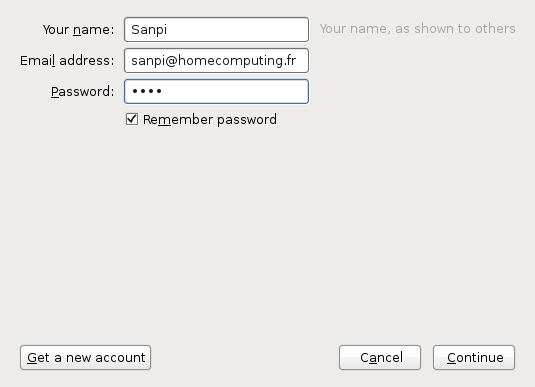

# Le serveur mail {#mail}

Le serveur de mail est sûrement le serveur le plus compliqué que j’ai eu à
installer. Premièrement parce que ma connaissance dans ce domaine était proche
de zéro et deuxièmement un serveur de mail est en fait composé de plusieurs
éléments qui doivent communiquer entre eux :

* Un serveur SMTP pour l’envoi du courier ;
* Un serveur POP3 et/ou IMAP pour la consultation du courier ;
* Un anti-spam ;
* Un filtre de mail (afin d’envoyer les mails dans le dossier approprié) ;
* Un client mail.

Le rôle du protocole SMTP (et donc du serveur associé) est d’envoyer et de
recevoir des courriels. Comme souvent dans le monde Unix c’est la seule chose
qu’il sait faire mais il le fait bien. Nous utiliserons
[opensmtpd](https://www.opensmtpd.org/).

Une fois le courriel reçu sur votre serveur, vous devons pouvoir le consulter,
c’est ici qu’intervient le serveur POP3 ou IMAP. Le protocole POP3 permet de
récupérer ses messages sur son ordinateur alors que le protocole IMAP permet
simplement de les consulter, les messages restent sur le serveur. Comme je
souhaite pourvoir accéder à mes messages partout, j’ai opté pour le protocole
IMAP. Dans tous les cas le serveur utilisé,
[dovecot](https://fr.wikipedia.org/wiki/Dovecot) gère les deux.

Afin d’éviter cette plaie que sont les spams (et encore ce que vous recevait
dans votre boite ne sont qu’une partie du travail, vous aller dévouvrir l’envers
du décor) nous allons coupler le serveur SMTP avec un filtre anti-spam :
`rspamd`.

Comme nous ne sommes pas à l’abris de faux-positif, nous allons quand même
recevoir les spams dans notre boite de réception, mais utiliser
[sieve](https://fr.wikipedia.org/wiki/Sieve) (qui est un protocole disponible
avec `dovecot` sous forme de greffon) qui va nous permettre de déplacer les
courriels indésirables dans le dossier correspondant (entre autre…).

Et pour finir, il nous faut un logiciel pour lire notre courrier, j’ai choisi
d’avoir d’un côté
[thunderbird](https://fr.wikipedia.org/wiki/Mozilla_Thunderbird) sur mon PC de
bureau et d’un autre [roundcube](http://roundcube.net/) afin de consulter mes
messages en dehors de chez moi.

# Le serveur SMTP {#mail-smtp}

Opensmtpd n’est pas disponible dans le dépôts de debian jessie mais dans les
backports. Il nous suffit d’ajouter ce nouveau dépôts :

```
# echo "deb http://httpredir.debian.org/debian jessie-backports main contrib" > /etc/apt/sources.list.d/backports.list
# apt update
```

Nous pouvons maintenant installé opensmtpd :

```
# apt install opensmtpd
```

Lors de l’installation, il vous est demandé un nom de domaine et un compte
vers lequel seront envoyés les mails destinés aux utilisateurs root et
postmaster.

La configuration est très simple :

```:/etc/smtpd.conf
# This is the smtpd server system-wide configuration file.
# See smtpd.conf(5) for more information.

# If you edit the file, you have to run "smtpctl update table aliases"
table aliases file:/etc/aliases

# To accept external mail, replace with: listen on all
listen on eth0 hostname "example.org"

# Uncomment the following to accept external mail for domain "example.org"
accept from any for domain "example.org" alias <aliases> deliver to mbox

accept for local alias <aliases> deliver to mbox
accept for any relay
```
Le fichier `/etc/aliases`, à créer, contient les aliases de mail :

```:/etc/aliases
# /etc/aliases
mailer-daemon: postmaster
postmaster: root
nobody: root
hostmaster: root
usenet: root
news: root
webmaster: root
www: root
ftp: root
abuse: root
noc: root
security: root
root: sanpi
```

Il faut exécuter la commande `newaliases` après chaque modification de ce
fichier.

Vous pouvez ensuite installer la paquet `mailutils` afin de tester votre
serveur SMTP. Commençons par tester l'envoi de mail en local :

```
$ mail unmailvalide@example.org
Subject: Test
Mon premier message depuis mon propre serveur SMTP !
Cc:
```

Après avoir taper votre message, appuyez sur `enter` puis `Ctrl + D`.

Vous pouvez faire de même depuis votre ordinateur de bureau pour tester la
réception de mail :

```
$ mail sanpi@[192.168.1.42]
Cc:
Subject: Test
Merci pour ce premier message.
```

Ou, un peu plus compliqué, discuter directement avec le serveur via telnet :

```
$ telnet 192.168.1.42 25
Trying 192.168.1.42...
Connected to 192.168.1.42.
Escape character is '^]'.
220 example.org ESMTP OpenSMTPD
> HELO example.org
250 example.org Hello example.org [192.168.1.42], pleased to meet you
> MAIL FROM: <sanpi@example.org>
250 2.0.0: Ok
> RCPT TO: <sanpi@example.org>
250 2.1.5 Destination address valid: Recipient ok
> DATA
354 Enter mail, end with "." on a line by itself
> From: sanpi@example.org
> To: sanpi@example.org
> Subject: Test
>
> Merci pour ce premier message.
> .
250 2.0.0: 1c30d5c9 Message accepted for delivery
> QUIT
221 2.0.0: Bye
Connection closed by foreign host.
```

> ***note*** J'ai ajouté le caractère '>' devant les lignes saisies.

On commence par se présenter au serveur puis on renseigne l’emméteur et le
récepteur du message pour finir par le message (dont les enêtes du mail) terminé
par `enter`, `.` puis `enter`.

Du côté de notre serveur, on peux consulter notre nouveau message avec la
commande `mail` :

```
$ mail
Mail version 8.1.2 01/15/2001.  Type ? for help.
"/var/mail/vagrant": 1 message 1 new
>N  1 sanpi@example.org  Fri Jul 10 12:12   13/582
& 1
Message 1:
From sanpi@example.org  Fri Jul 10 12:12:26 2015
Date: Fri, 10 Jul 2015 12:12:09 +0000 (GMT)
From: sanpi@example.org
To: sanpi@example.org
Subject: Test

Merci pour ce premier message.

&
```

# Le serveur IMAP {#mail-imap}

Comme indiqué dans l'introduction, je me contente d'utiliser le protocole IMAP
afin de pouvoir consulter mes mails depuis n'importe quel ordinateur. Si vous
souhaitez installer un serveur POP3 (pour vos utilisateurs, par exemple), il
suffit de remplacer les occurrences de *imap* par *pop3*.

Comme à l'accoutumée, commençons pas installer le serveur :

```
# apt-get install dovecot-imapd
```

Afin de tester que tout fonctionne avec `telnet` nous devons autoriser
l'authentification avec le mot de passe en clair en décommentant l'option
`disable\_plaintext\_auth` dans le fichier `/etc/dovecot/conf.d/10-auth.conf` :

```
$ telnet 192.168.1.42 143
Trying 192.168.1.42...
Connected to 192.168.1.42.
Escape character is '^]'.
* OK [CAPABILITY IMAP4rev1 LITERAL+ SASL-IR LOGIN-REFERRALS ID ENABLE IDLE AUTH=PLAIN] Dovecot ready.
x LOGIN guest 1234
x OK [CAPABILITY IMAP4rev1 LITERAL+ SASL-IR LOGIN-REFERRALS ID ENABLE IDLE SORT SORT=DISPLAY THREAD=REFERENCES THREAD=REFS THREAD=ORDEREDSUBJECT MULTIAPPEND URL-PARTIAL CATENATE UNSELECT CHILDREN NAMESPACE UIDPLUS LIST-EXTENDED I18NLEVEL=1 CONDSTORE QRESYNC ESEARCH ESORT SEARCHRES WITHIN CONTEXT=SEARCH LIST-STATUS SPECIAL-USE BINARY MOVE] Logged in
x SELECT INBOX
* FLAGS (\Answered \Flagged \Deleted \Seen \Draft)
* OK [PERMANENTFLAGS (\Answered \Flagged \Deleted \Seen \Draft \*)] Flags permitted.
* 0 EXISTS
* 0 RECENT
* OK [UIDVALIDITY 1436531078] UIDs valid
* OK [UIDNEXT 1] Predicted next UID
x OK [READ-WRITE] Select completed (0.000 secs).
> x FETCH 1:* (FLAGS BODY[HEADER.FIELDS (DATE FROM)])
* 1 FETCH (FLAGS (\Seen) BODY[HEADER.FIELDS (DATE FROM)] {87}
Date: Fri, 10 Jul 2015 12:12:09 +0000 (GMT)
From: sanpi@example.org

)
x OK Fetch completed.
> x LOGOUT
* BYE Logging out
x OK Logout completed.
Connection closed by foreign host.
```

> ***warning*** Les commandes envoyées au serveur doivent commencées par un
> caractère quelconque, ici il s'agit de 'x'.

Vous pouvez aussi tester avec `thunderbird` comme le montre la figure suivante.


# Format de stockage des mails {#mail-maildir}

Il existe deux principaux formats de stockage des mails, le premier *mbox*. Il
consiste à stocker l'ensemble des messages d'un même dossier dans un seul
fichier. En plus de rapidement poser des problèmes de performances, nous
risquons aussi d'atteindre la limite de la taille d'un fichier.

C'est pour ces raisons que nous allons utiliser le second format, *Maildir*,
qui stocke chaque mail dans un fichier regroupé dans différents dossiers.

Côté `opensmtpd`, il suffit de remplacer les occurences de `mbox` par `maildir`
dans `/etc/smtpd.conf`:

```:/etc/smtpd.conf
accept from any for domain "example.org" alias <aliases> deliver to maildir
accept for local alias <aliases> deliver to maildir
```

Pour `dovecot`, nous créons un nouveau fichier de configuration qui va contenir
nos modifications afin d’éviter les conflits lors des mises à jour à venir :

```:/etc/dovecot/conf.d/99-custom.conf
mail_location = maildir:~/Maildir
```

Enfin redémarrons les serveurs pour que le changement soit pris en compte :

```
# systemctl restart opensmtpd.service
# systemctl restart dovecot.service
```

# Installation d'un client de messagerie {#mail-client}

Nous allons dés à présent installer nos clients de messagerie afin de pouvoir
tester les fonctionnalités suivantes plus simplement.

## Client lourd

Ce que l'on appelle couramment un client lourd, dans le monde de
l'informatique, est simplement un logiciel installé sur votre ordinateur.

Il en existe plusieurs si vous ne savez pas lequel choisir, je vous conseil
[thunderbird](https://www.mozilla.org/fr/thunderbird/) qui fonctionne sur la
majorité des système d'exploitation et qui est très simple d'utilisation.

> ***warning*** Sous Debian, pour des questions de marque déposée, `thunderbird`
> est renommé `icedove`.

Lors du premier démarrage, `thunderbird` vous demande un certain nombres
d'information, comme le montre la figure suivante, afin de vous aider à
configurer votre compte.



Ensuite le ligiciel essaie de détecter automatiquement le port utilisé par
chaque protocole ainsi que le chiffrement. Si cela échou, passez en
configuration manuelle :


Une fois validé, vous pouvez commencer à l'utiliser !

> ***note*** Ce chapitre est un rapide apperçu de `thunderbird`, si vous
> souhaitez en savoir plus, vous pouvez lire [le manuel
> libre](http://fr.flossmanuals.net/thunderbird/).


> ***warning*** Comme vous l’indique thunderbird, actuellement toutes vos
> communication avec le serveur de mail sont en claires. Nous corrigerons ceci
> au chapitre [SSL](ssl.md), en attendant ne l’utilisez pas pour autre chose que
> des tests.

## Client léger

L'opposer du client lourd, un client léger n'est pas installé directement sur
votre ordinateur mais sur un serveur. Il s'agit simplement d'une applications
web.

J'ai eu beaucoup de mal à trouver un *webmail* agréable à l’œil et fonctionnel,
je me suis arrêté sur `roundcube`.

L'installation est très simple et reste semblable à exemple évoqué au chapitre
[Quelques logiciels](#http-logiciels), le tout est détaillé dans le fichier
`INSTALL`.

## Client mobile

[K-9 mail](https://f-droid.org/repository/browse/?fdid=com.fsck.k9).
