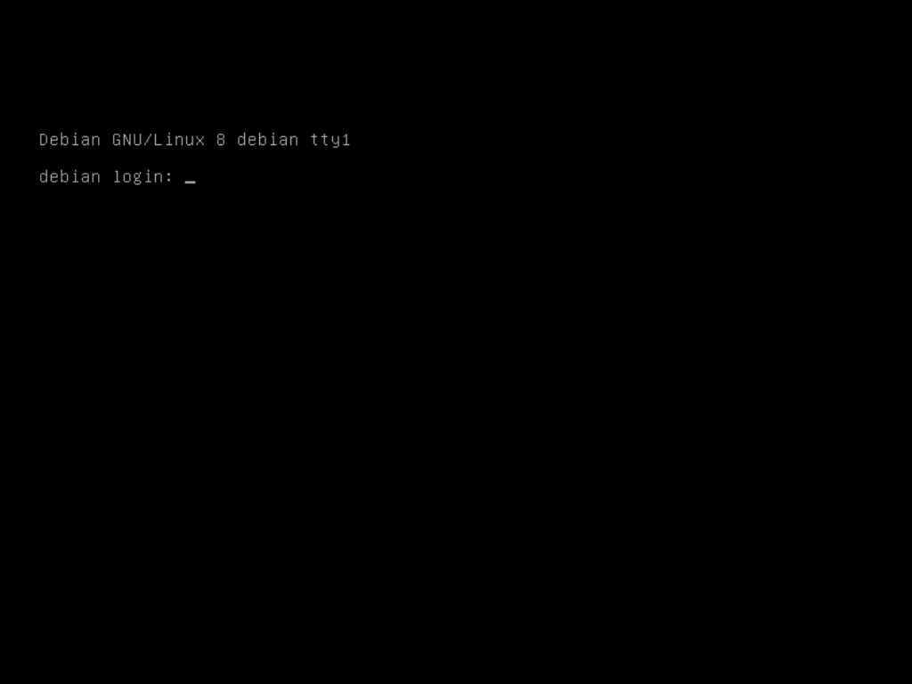

# Premier redémarrage

Après quelques secondes, vous obtenez un *prompt* qui vous demande un nom
d'utilisateur.



## Désactiver le compte root {#root}

> ***Info*** Si vous avez laissez le mot de passe `root` vide lors de
> l’installation, ceci est déjà correctement configuré.

Il n’y a aucune raison de se connecter directement en tant que `root`, par
conséquent autant désactiver ce compte et passer par la commande `sudo` pour
exécuter les tâches d’administration.

Commencez par vous connecter avec le compte `root`.

Si ce n’est pas encore fait, installez sudo :

```
# apt-get install sudo
```

La configuration par défaut autorise les membres du groupe `sudo` à utiliser la
commande en saisissant leur mot de passe. Il nous suffit d’ajouter notre
utilisateur au groupe `sudo` :

```
# adduser sanpi sudo
```

Avant de nous déconnecter, nous allons vérifier que tout fonctionne
correctement. Appuyez sur les touches `Ctrl+alt+F2`, ceci aura pour effet de
basculer dans un second terminal (*tty2*) où vous pouvez vous connecter avec
votre compte utilisateur puis tester la commande `sudo` :

```
$ sudo -s
We trust you have received the usual lecture from the local System
Administrator. It usually boils down to these three things:

    #1) Respect the privacy of others.
    #2) Think before you type.
    #3) With great power comes great responsibility.

[sudo] password for sanpi:
# exit
```

> ***Info*** Pour fermer votre session, vous pouvez utiliser la commande `exit`
> ou simplement appuyez sur les touches `Ctrl+D`

Saisissez à nouveau votre mot de passe. Si tout se passe bien, il nous reste à
désactiver le compte `root` :

```
$ sudo passwd -l root
```

## Premier pas {#premier-pas}

Pour commencer, nous devons mettre à jour le système :

```
$ sudo -s
# apt-get update
# apt-get upgrade
```

Sachant que cette tâches doit être effectuée régulièrement afin d'assurée la
sécurité de votre serveur, nous verrons au chapitre [mises à jour
automatiques](securite.md#cron-apt) comment gérer ceci de façon automatique.

Comme la majeure partie des manipulations effectuées sur votre serveur se
fera via la ligne de commande, il est nécessaire d'avoir quelques outils.

Voici rapide aperçu de ceux déjà installés :

* `nano` : un éditeur de texte ;
* `tar`, `gzip` : respectivement un outils pour archiver et pour
    compresser les fichiers, le format `.tar.gz` est souvent utilisé ;
* `wget` : vous permet de télécharger un fichier.

Si vous souhaitez avoir de l'aide sur une commande, prenez le réflexe
d'utiliser la commande `man` suivie du nom du programme :

```
$ man tar
```

Vous obtiendrez la page de manuelle associée, ici à la commande `tar`,
comme le montre la figure 4-2, parfois en français mais dans
tout les cas claire et complète, bref généralement un bon point de départ
pour trouver réponses à vos questions.


Vous l'aurez remarqué, il n'est pas très aisé de naviguer dans la documentation
puisque nous pouvons uniquement passer à la page suivante en appuyant sur la
touche `espace`. Afin de pouvoir naviguer de façon plus naturelle, avec
les flèches du clavier, vous pouvez installer le programme `less` :

```
# apt-get install less
```

Nous venons de passer en revue une bonne partie des commandes qui vont seront
utiles dans la suite de ce livre pour visualiser, éditer des fichiers et
installer des programmes (pour plus d'information à ceux sujet, vous pouvez
vous reportez à l'annexe [gestion des paquest](annexes/gestion-paquets.md)).
